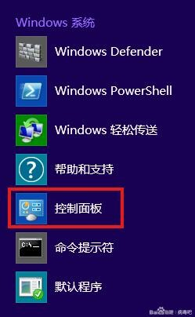
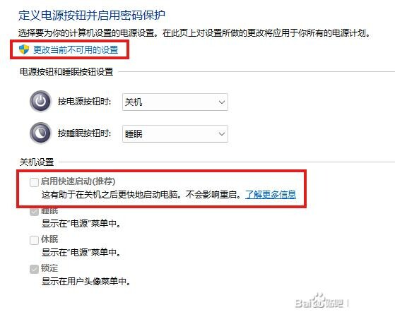

这两个问题大概率可以使用同一个方法解决——关闭快速启动。

## 为什么要关闭快速启动

Windows 10 开始，有了一个新功能叫快速启动。但是我更愿意叫它bug启动——相对于系统的其他部分快速启动起码在本人的电脑上几乎没有正确工作过。

这两个问题很大概率都是快速启动引起的，这种情况下最快解决问题的方案就是关闭快速启动——反正在使用固态硬盘的情况下，开不开快速启动只差了几秒而已。

## 怎么关闭快速启动

### 第一步

打开控制面板。

Windows 10&Windows 8.1：

开始-Windows系统-控制面板

Windows 11：

开始-所有程序-Windows工具-控制面板

### 第二步

在控制面板的搜索框内输入“电源”，之后点击“更改电源按钮的功能”

### 第三步

点击“更改当前不可用设置”，并取消选中“启用快速启动（推荐）”

